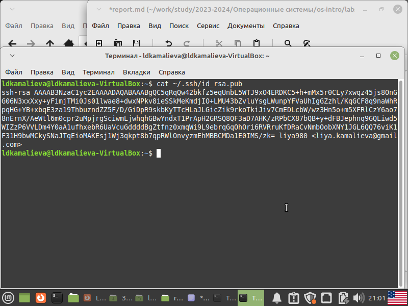
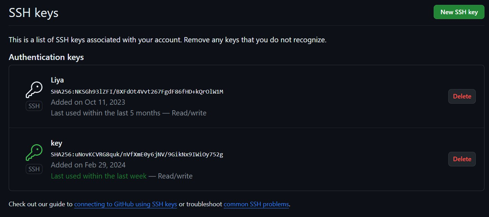
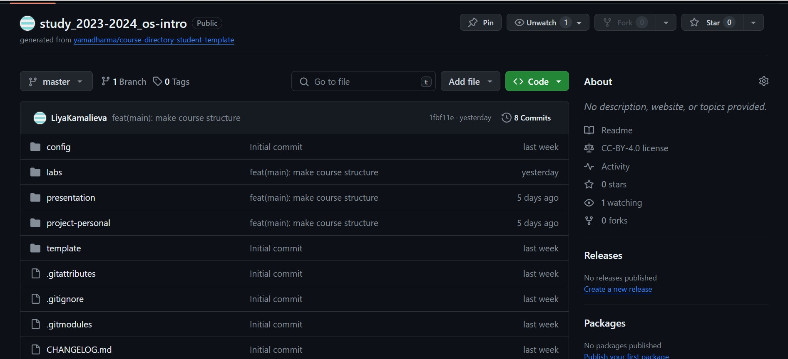
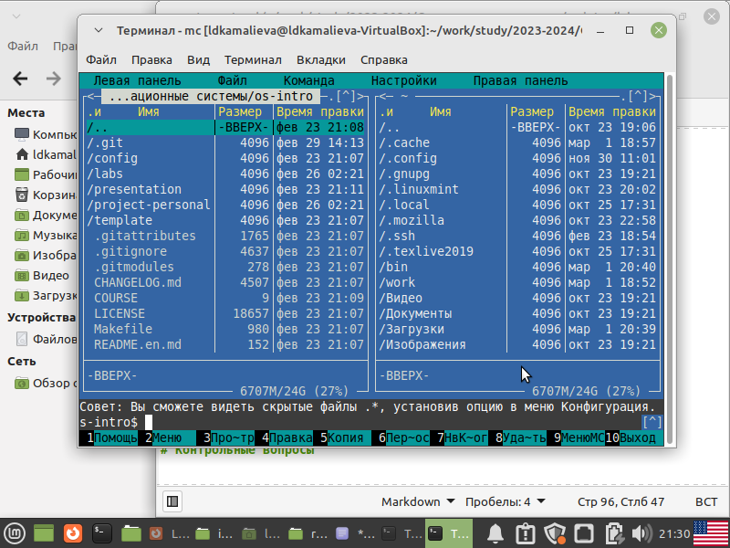

---
## Front matter
title: "Отчет по лабораторной №2"
subtitle: "Базовая настройка git"
author: "Камалиева Лия Дамировна"

## Generic otions
lang: ru-RU
toc-title: "Содержание"

## Bibliography
bibliography: bib/cite.bib
csl: pandoc/csl/gost-r-7-0-5-2008-numeric.csl

## Pdf output format
toc: true # Table of contents
toc-depth: 2
lof: true # List of figures
lot: true # List of tables
fontsize: 12pt
linestretch: 1.5
papersize: a4
documentclass: scrreprt
## I18n polyglossia
polyglossia-lang:
  name: russian
  options:
	- spelling=modern
	- babelshorthands=true
polyglossia-otherlangs:
  name: english
## I18n babel
babel-lang: russian
babel-otherlangs: english
## Fonts
mainfont: PT Serif
romanfont: PT Serif
sansfont: PT Sans
monofont: PT Mono
mainfontoptions: Ligatures=TeX
romanfontoptions: Ligatures=TeX
sansfontoptions: Ligatures=TeX,Scale=MatchLowercase
monofontoptions: Scale=MatchLowercase,Scale=0.9
## Biblatex
biblatex: true
biblio-style: "gost-numeric"
biblatexoptions:
  - parentracker=true
  - backend=biber
  - hyperref=auto
  - language=auto
  - autolang=other*
  - citestyle=gost-numeric
## Pandoc-crossref LaTeX customization
figureTitle: "Рис."
tableTitle: "Таблица"
listingTitle: "Листинг"
lofTitle: "Список иллюстраций"
lotTitle: "Список таблиц"
lolTitle: "Листинги"
## Misc options
indent: true
header-includes:
  - \usepackage{indentfirst}
  - \usepackage{float} # keep figures where there are in the text
  - \floatplacement{figure}{H} # keep figures where there are in the text
---

# Цель работы

    Изучить идеологию и применение средств контроля версий.
    Освоить умения по работе с git.

# Задание

Создать свой репозиторий

# Теоретическое введение

Системы контроля версий (Version Control System, VCS) применяются при работе нескольких человек над одним проектом. Обычно основное дерево проекта хранится в локальном или удалённом репозитории, к которому настроен доступ для участников проекта. При внесении изменений в содержание проекта система контроля версий позволяет их фиксировать, совмещать изменения, произведённые разными участниками проекта, производить откат к любой более ранней версии проекта, если это требуется.

В классических системах контроля версий используется централизованная модель, предполагающая наличие единого репозитория для хранения файлов. Выполнение большинства функций по управлению версиями осуществляется специальным сервером. Участник проекта (пользователь) перед началом работы посредством определённых команд получает нужную ему версию файлов. После внесения изменений, пользователь размещает новую версию в хранилище. При этом предыдущие версии не удаляются из центрального хранилища и к ним можно вернуться в любой момент. Сервер может сохранять не полную версию изменённых файлов, а производить так называемую дельта-компрессию — сохранять только изменения между последовательными версиями, что позволяет уменьшить объём хранимых данных.

Системы контроля версий поддерживают возможность отслеживания и разрешения конфликтов, которые могут возникнуть при работе нескольких человек над одним файлом. Можно объединить (слить) изменения, сделанные разными участниками (автоматически или вручную), вручную выбрать нужную версию, отменить изменения вовсе или заблокировать файлы для изменения. В зависимости от настроек блокировка не позволяет другим пользователям получить рабочую копию или препятствует изменению рабочей копии файла средствами файловой системы ОС, обеспечивая таким образом, привилегированный доступ только одному пользователю, работающему с файлом.

Системы контроля версий также могут обеспечивать дополнительные, более гибкие функциональные возможности. Например, они могут поддерживать работу с несколькими версиями одного файла, сохраняя общую историю изменений до точки ветвления версий и собственные истории изменений каждой ветви. Кроме того, обычно доступна информация о том, кто из участников, когда и какие изменения вносил. Обычно такого рода информация хранится в журнале изменений, доступ к которому можно ограничить.

В отличие от классических, в распределённых системах контроля версий центральный репозиторий не является обязательным.

Среди классических VCS наиболее известны CVS, Subversion, а среди распределённых — Git, Bazaar, Mercurial. Принципы их работы схожи, отличаются они в основном синтаксисом используемых в работе команд.

# Выполнение лабораторной работы

Шаг 1. Создаем имя и e-mail владельца репозитория (у меня уже было)

Шаг 2. Базовая настройка git (у меня уже была)

Шаг 3. Создание ssh ключа

Шаг 4. Добавляем ключи в github

# Cоздание репозитория курса на основе шаблона

Шаг 1. Создедим его с помощью команд mkdir, gh и git clone

Шаг 2. проверим создание каталога в github

# Настроим каталог курса

Шаг 1. переходим в каталог курса

Шаг 2. Удалим файл rm package.json

Шаг 3. Создаем каталоги, по типу labs

Шаг 4. Отправляем все на github

# Контрольные вопросы

1. Что такое системы контроля версий (VCS) и для решения каких задач они предназначаются?
Это программное обеспечение для облегчения работы с
изменяющейся информацией. VCS позволяет хранить несколько версий одного
и того же документа, при необходимости возвращаться к более ранним версиям,
определять, кто и когда сделал то или иное изменение, и многое другое. переформулируй текст

2. Объясните следующие понятия VCS и их отношения: хранилище, commit, история, рабочая копия.
Это программное обеспечение предназначено для управления изменениями в документах. С его помощью можно сохранять несколько версий одного файла, отслеживать историю изменений, определять авторство и время внесения изменений и многое другое.

3. Что представляют собой и чем отличаются централизованные и децентрализованные VCS? Приведите примеры VCS каждого вида.
Хранилище (репозитарий) - это место, где хранятся все версии файлов и служебная информация. Commit («вклад») - это процесс создания новой версии файлов. История - это записи о всех коммитах, позволяющие просматривать информацию о них. Рабочая копия - это текущее состояние файлов проекта, основанное на версии из хранилища.

4. Опишите действия с VCS при единоличной работе с хранилищем.
Централизованные VCS хранятся на центральном сервере, к которому имеют доступ все участники проекта. Они управляют версиями файлов, позволяют фиксировать изменения и отслеживать историю проекта. Примером централизованной системы контроля версий является Subversion (SVN). Децентрализованные VCS не требуют центрального сервера и позволяют каждому разработчику работать независимо от других. Участники проекта могут сохранять изменения локально и обмениваться ими с помощью сетевых команд. Примером децентрализованной системы контроля версий является Git.

5. Опишите порядок работы с общим хранилищем VCS.При единоличной работе с хранилищем (Version Control System, VCS) основные действия пользователя включают в себя: Клонирование репозитория: Пользователь создает локальную копию удаленного репозитория на своем компьютере.Создание новой ветки: Пользователь может создавать отдельные ветки для разработки новых функций или исправления ошибок, не затрагивая основную ветку.Добавление изменений: Пользователь вносит изменения в файлы проекта и коммитит их в локальный репозиторий.Переключение между ветками: Пользователь может переключаться между различными ветками, чтобы работать над разными задачами.

6. Каковы основные задачи, решаемые инструментальным средством git?
Установите и сконфигурируйте программное обеспечение VCS на своем компьютере. 
Создайте репозиторий для проекта в общем хранилище VCS, например, на платформе GitHub или GitLab.Загрузите свой проект в репозиторий, используя команды VCS для добавления, коммита и пуша изменений. Работайте со своим проектом, внося изменения в код и документацию. Регулярно обновляйте свой локальный репозиторий с изменениями из общего хранилища, чтобы быть в курсе последних обновлений и избежать конфликтов. Работайте над задачами и исправлениями багов, создавая и закрывая ветки в репозитории. Коммуницируйте с другими участниками проекта через общее хранилище VCS, обмениваясь кодом, комментариями и запросами на слияние изменений.

7. Назовите и дайте краткую характеристику командам git. git –version (Провер- 
ка версии Git) git init (Инициализировать ваш текущий рабочий каталог как 
Git-репозиторий) git clone https://www.github.com/username/repo-name (Ско- 
пировать существующий удаленный Git-репозиторий) git remote (Просмотреть 
список текущих удалённых репозиториев Git) git remote -v (Для более подроб- 
ного вывода) git add my_script.py (Можете указать в команде конкретный 
файл). git add . (Позволяет охватить все файлы в текущем каталоге, включая 
файлы, чье имя начинается с точки) git commit -am “Commit message” (Вы 
можете сжать все индексированные файлы и отправить коммит). git branch 
(Просмотреть список текущих веток можно с помощью команды branch) git 
–help (Чтобы узнать больше обо всех доступных параметрах и командах) git 
push origin master (Передать локальные коммиты в ветку удаленного репози- 
тория).

8. Приведите примеры использования при работе с локальным и удалённым 
репозиториями.

9. Что такое и зачем могут быть нужны ветви (branches)? Ветки нужны, чтобы 
несколько программистов могли вести работу над одним и тем же проектом 
или даже файлом одновременно, при этом не мешая друг другу. Кроме того, 
ветки используются для тестирования экспериментальных функций: чтобы не 
повредить основному проекту, создается новая ветка специально для экспери- 
ментов.

10. Как и зачем можно игнорировать некоторые файлы при commit? Игнорируемые 
файлы — это, как правило, артефакты сборки и файлы, генерируемые машиной 
из исходных файлов в вашем репозитории, либо файлы, которые по какой-либо 
иной причине не должны попадать в коммиты.

# Выводы
я создала репозиторий и поработала c git

# Список литературы{.unnumbered}

