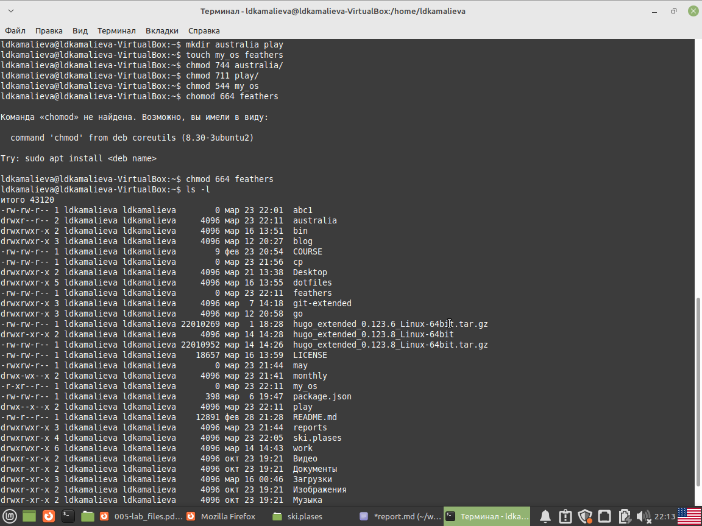
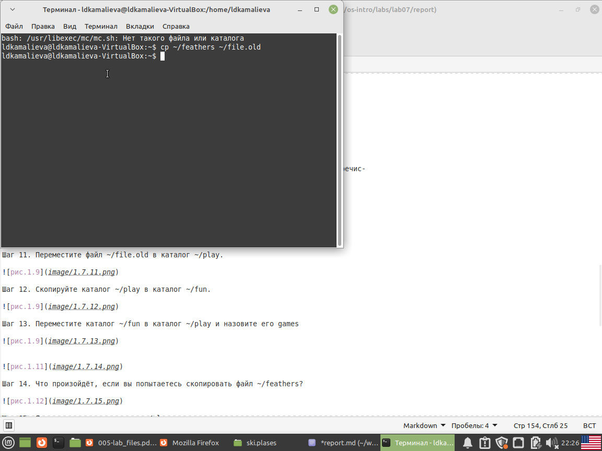
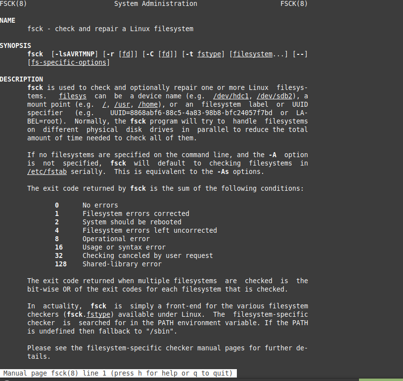
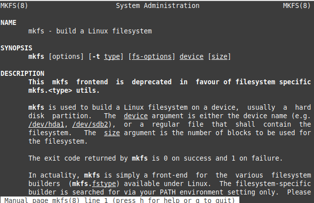

---
## Front matter
title: "Отчет по лабораторной №7"
subtitle: "Анализ файловой системы Linux.Команды для работы с файлами и каталогами"
author: "Камалиева Лия Дамировна"

## Generic otions
lang: ru-RU
toc-title: "Содержание"

## Bibliography
bibliography: bib/cite.bib
csl: pandoc/csl/gost-r-7-0-5-2008-numeric.csl

## Pdf output format
toc: true # Table of contents
toc-depth: 2
lof: true # List of figures
lot: true # List of tables
fontsize: 12pt
linestretch: 1.5
papersize: a4
documentclass: scrreprt
## I18n polyglossia
polyglossia-lang:
  name: russian
  options:
	- spelling=modern
	- babelshorthands=true
polyglossia-otherlangs:
  name: english
## I18n babel
babel-lang: russian
babel-otherlangs: english
## Fonts
mainfont: PT Serif
romanfont: PT Serif
sansfont: PT Sans
monofont: PT Mono
mainfontoptions: Ligatures=TeX
romanfontoptions: Ligatures=TeX
sansfontoptions: Ligatures=TeX,Scale=MatchLowercase
monofontoptions: Scale=MatchLowercase,Scale=0.9
## Biblatex
biblatex: true
biblio-style: "gost-numeric"
biblatexoptions:
  - parentracker=true
  - backend=biber
  - hyperref=auto
  - language=auto
  - autolang=other*
  - citestyle=gost-numeric
## Pandoc-crossref LaTeX customization
figureTitle: "Рис."
tableTitle: "Таблица"
listingTitle: "Листинг"
lofTitle: "Список иллюстраций"
lotTitle: "Список таблиц"
lolTitle: "Листинги"
## Misc options
indent: true
header-includes:
  - \usepackage{indentfirst}
  - \usepackage{float} # keep figures where there are in the text
  - \floatplacement{figure}{H} # keep figures where there are in the text
---

# Цель работы

Ознакомление с файловой системой Linux, её структурой, именами и содержанием
каталогов. Приобретение практических навыков по применению команд для работы
с файлами и каталогами, по управлению процессами (и работами), по проверке исполь-
зования диска и обслуживанию файловой системы.

# Теоретическое введение

Права доступа
Каждый файл или каталог имеет права доступа (табл. 5.1).
В сведениях о файле или каталоге указываются:
– тип файла (символ (-) обозначает файл, а символ (d) — каталог);
– права для владельца файла (r — разрешено чтение, w — разрешена запись, x — разре-
шено выполнение, - — право доступа отсутствует);
– права для членов группы (r — разрешено чтение, w — разрешена запись, x — разрешено
выполнение, - — право доступа отсутствует);
– права для всех остальных (r — разрешено чтение, w — разрешена запись, x — разрешено
выполнение, - — право доступа отсутствует)

# Выполнение лабораторной работы

Шаг 1. Выполняю все примеры, приведённые в первой части описания лабораторной работы.

Шаг 2.  В домашнем каталоге создайте директорию ~/ski.plases.

Шаг 3. Переместите файл equipment в каталог ~/ski.plases

Шаг 4. Переименуйте файл ~/ski.plases/equipment в ~/ski.plases/equiplist

Шаг 5. Создайте в домашнем каталоге файл abc1 и скопируйте его в каталог
~/ski.plases, назовите его equiplist2.

Шаг 6. создайте каталог с именем equipment в каталоге ~/ski.plases.

Шаг 7. Переместите файлы ~/ski.plases/equiplist и equiplist2 в каталог
~/ski.plases/equipment.

Шаг 8.Создайте и переместите каталог ~/newdir в каталог ~/ski.plases и назовите
его plans

Шаг 9. я определила опции команды chmod, необходимые для того, чтобы присвоить перечис-
ленным ниже файлам выделенные права доступа, считая, что в начале таких прав нет

Шаг 10. Скопируйте файл ~/feathers в файл ~/file.old

Шаг 11. Переместите файл ~/file.old в каталог ~/play.

Шаг 12. Скопируйте каталог ~/play в каталог ~/fun.

Шаг 13. Переместите каталог ~/fun в каталог ~/play и назовите его games

Шаг 15. Лишите владельца каталога ~/play права на выполнение.

Шаг 16. Перейдите в каталог ~/play. Что произошло?

будет выведено сообщение об ошибке

Шаг 17. Дайте владельцу каталога ~/play право на выполнение.

Шаг 18. man mount.  команда для подключения файловых систем к директории в иерархии файловой системы Linux. Пример: mount /dev/sdb1 /mnt/usb - подключение USB устройства к директории /mnt/usb

Шаг 19. man fsck.  команда для проверки и восстановления целостности файловой системы. Пример: fsck /dev/sda1 - проверка и восстановление файловой системы на разделе /dev/sda1. 

Шаг 19. mkfs - команда для создания новой файловой системы на указанном устройстве. Пример: mkfs.ext4 /dev/sdb1 - создание файловой системы ext4 на USB устройстве /dev/sdb1. 

Шаг 19. команда для завершения процессов в Linux. Пример: kill PID - отправка сигнала завершения процессу с указанным идентификатором PID. 

## Контрольные вопросы
1 Дайте характеристику каждой файловой системе, существующей на жёстком диске компьютера, на котором вы выполняли лабораторную работу.Ext2, Ext3, Ext4 или Extended Filesystem - это стандартная файловая система для Linux. Она была разработана еще для Minix. Она самая стабильная из всех существующих, кодовая база изменяется очень редко и эта файловая система содержит больше всего функций. Версия ext2 была разработана уже именно для Linux и получила много улучшений. В 2001 году вышла ext3, которая добавила еще больше стабильности благодаря использованию журналирования. В 2006 была выпущена версия ext4, которая используется во всех дистрибутивах Linux до сегодняшнего дня. В ней было внесено много улучшений, в том числе увеличен максимальный размер раздела до одного экзабайта. JFS или Journaled File System была разработана в IBM для AIX UNIX и использовалась в качестве альтернативы для файловых систем ext. Сейчас она используется там, где необходима высокая стабильность и минимальное потребление ресурсов. При разработке файловой системы ставилась цель создать максимально эффективную файловую систему для многопроцессорных компьютеров. Также как и ext, это журналируемая файловая система, но в журнале хранятся только метаданные, что может привести к использованию старых версий файлов после сбоев. ReiserFS - была разработана намного позже, в качестве альтернативы ext3 с улучшенной производительностью и расширенными возможностями. Она была разрабо- тана под руководством Ганса Райзера и поддерживает только Linux. Из особенностей можно отметить динамический размер блока, что позволяет упаковывать несколько небольших файлов в один блок, что предотвращает фрагментацию и улучшает
работу с небольшими файлами. Еще одно преимущество - в возможности изменять
размеры разделов на лету. Но минус в некоторой нестабильности и риске потери
данных при отключении энергии. Раньше ReiserFS применялась по умолчанию в
SUSE Linux, но сейчас разработчики перешли на Btrfs.
XFS - это высокопроизводительная файловая система, разработанная в Silicon
Graphics для собственной операционной системы еще в 2001 году. Она изначально
была рассчитана на файлы большого размера, и поддерживала диски до 2 Терабайт.
Из преимуществ файловой системы можно отметить высокую скорость работы с
большими файлами, отложенное выделение места, увеличение разделов на лету и
незначительный размер служебной информации.
XFS - журналируемая файловая система, однако в отличие от ext, в журнал
записываются только изменения метаданных. Она используется по умолчанию в
дистрибутивах на основе Red Hat. Из недостатков - это невозможность уменьшения
размера, сложность восстановления данных и риск потери файлов при записи, если
будет неожиданное отключение питания, поскольку большинство данных находится
в памяти.
Btrfs или B-Tree File System - это совершенно новая файловая система, которая
сосредоточена на отказоустойчивости, легкости администрирования и восстановле-
ния данных. Файловая система объединяет в себе очень много новых интересных
возможностей, таких как размещение на нескольких разделах, поддержка подто-
мов, изменение размера не лету, создание мгновенных снимков, а также высокая
производительность. Но многими пользователями файловая система Btrfs счита-
ется нестабильной. Тем не менее, она уже используется как файловая система по
умолчанию в OpenSUSE и SUSE Linux.
2 Приведите общую структуру файловой системы и дайте характеристику каж-
дой директории первого уровня этой структуры.
/ — root каталог. Содержит в себе всю иерархию системы;
/bin — здесь находятся двоичные исполняемые файлы. Основные общие команды,
хранящиеся отдельно от других программ в системе (прим.: pwd, ls, cat, ps);
/boot — тут расположены файлы, используемые для загрузки системы (образ
initrd, ядро vmlinuz);
/dev — в данной директории располагаются файлы устройств (драйверов). С
помощью этих файлов можно взаимодействовать с устройствами. К примеру, если
это жесткий диск, можно подключить его к файловой системе. В файл принтера же
можно написать напрямую и отправить задание на печать;
/etc — в этой директории находятся файлы конфигураций программ. Эти файлы
позволяют настраивать системы, сервисы, скрипты системных демонов;
/home — каталог, аналогичный каталогу Users в Windows. Содержит домашние
каталоги учетных записей пользователей (кроме root). При создании нового поль-
зователя здесь создается одноименный каталог с аналогичным именем и хранит
личные файлы этого пользователя;
/lib — содержит системные библиотеки, с которыми работают программы и модули
ядра;
/lost+found — содержит файлы, восстановленные после сбоя работы системы.
Система проведет проверку после сбоя и найденные файлы можно будет посмотреть
в данном каталоге;
/media — точка монтирования внешних носителей. Например, когда вы вставляете
диск в дисковод, он будет автоматически смонтирован в директорию /media/cdrom;
/mnt — точка временного монтирования. Файловые системы подключаемых
устройств обычно монтируются в этот каталог для временного использования;
/opt — тут расположены дополнительные (необязательные) приложения. Такие
программы обычно не подчиняются принятой иерархии и хранят свои файлы в
одном подкаталоге (бинарные, библиотеки, конфигурации);
/proc — содержит файлы, хранящие информацию о запущенных процессах и о
состоянии ядра ОС;
/root — директория, которая содержит файлы и личные настройки суперпользователя;
/run — содержит файлы состояния приложений. Например, PID-файлы или UNIX-
сокеты;
/sbin — аналогично /bin содержит бинарные файлы. Утилиты нужны для на-
стройки и администрирования системы суперпользователем;
/srv — содержит файлы сервисов, предоставляемых сервером (прим. FTP или
Apache HTTP);
/sys — содержит данные непосредственно о системе. Тут можно узнать информа-
цию о ядре, драйверах и устройствах;
/tmp — содержит временные файлы. Данные файлы доступны всем пользователям
на чтение и запись. Стоит отметить, что данный каталог очищается при перезагрузке;
/usr — содержит пользовательские приложения и утилиты второго уровня, исполь-
зуемые пользователями, а не системой. Содержимое доступно только для чтения
(кроме root). Каталог имеет вторичную иерархию и похож на корневой;
/var — содержит переменные файлы. Имеет подкаталоги, отвечающие за отдельные
переменные. Например, логи будут храниться в /var/log, кэш в /var/cache, очереди
заданий в /var/spool/ и так далее.
3 Какая операция должна быть выполнена, чтобы содержимое некоторой фай-
ловой системы было доступно операционной системе?
Монтирование тома.
4 Назовите основные причины нарушения целостности файловой системы. Как
устранить повреждения файловой системы?
Отсутствие синхронизации между образом файловой системы в памяти и ее
данными на диске в случае аварийного останова может привести к появлению
следующих ошибок:
• Один блок адресуется несколькими mode (принадлежит нескольким файлам).
Блок помечен как свободный, но в то же время занят (на него ссылается
onode).
• Блок помечен как занятый, но в то же время свободен (ни один inode на него
не ссылается).
• Неправильное число ссылок в inode (недостаток или избыток ссылающихся
записей в каталогах).
• Несовпадение между размером файла и суммарным размером адресуемых
inode блоков.
• Недопустимые адресуемые блоки (например, расположенные за пределами
файловой системы).
• “Потерянные” файлы (правильные inode, на которые не ссылаются записи
каталогов).
• Недопустимые или неразмещенные номера inode в записях каталогов.
5 Как создаётся файловая система?
mkfs - позволяет создать файловую систему Linux.
6 Дайте характеристику командам для просмотра текстовых файлов.
Cat - выводит содержимое файла на стандартное устройство вывода
7 Приведите основные возможности команды cp в Linux.
Cp – копирует или перемещает директорию, файлы.
8 Приведите основные возможности команды mv в Linux.
Mv - переименовать или переместить файл или директорию
9 Что такое права доступа? Как они могут быть изменены?
Права доступа к файлу или каталогу можно изменить, воспользовавшись командой
chmod. Сделать это может владелец файла (или каталога) или пользователь с
правами администратора.

# Выводы

я научилась работать с файловой системой линукс

# Список литературы{.unnumbered}

